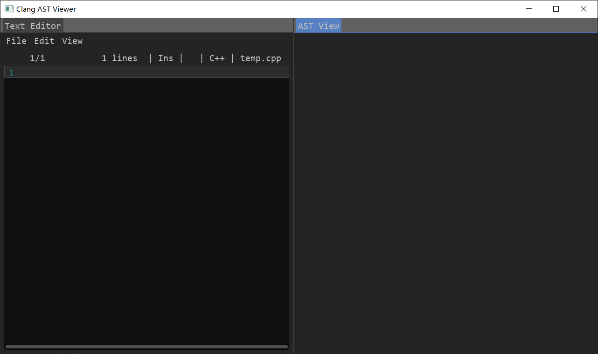
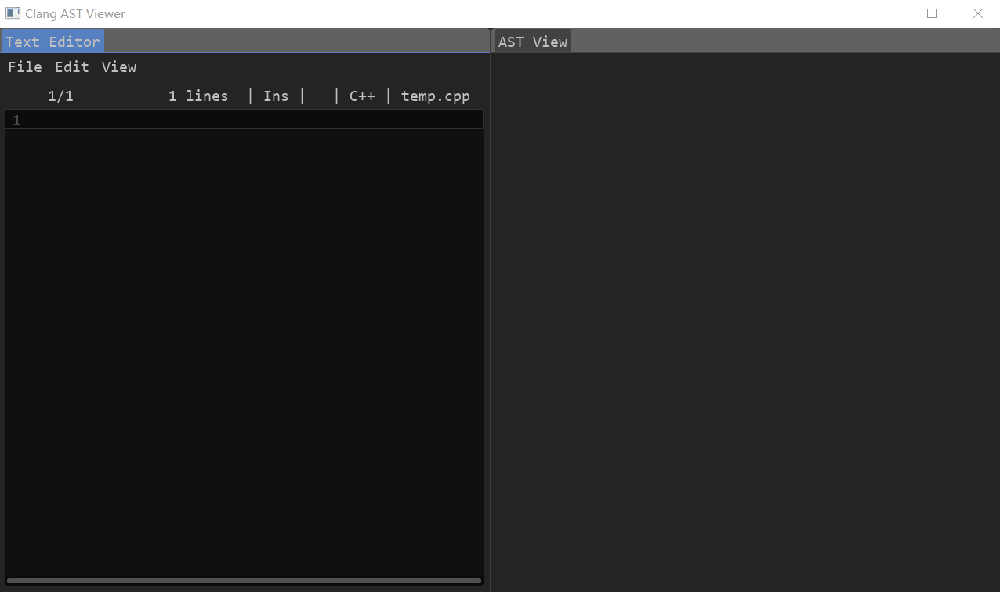
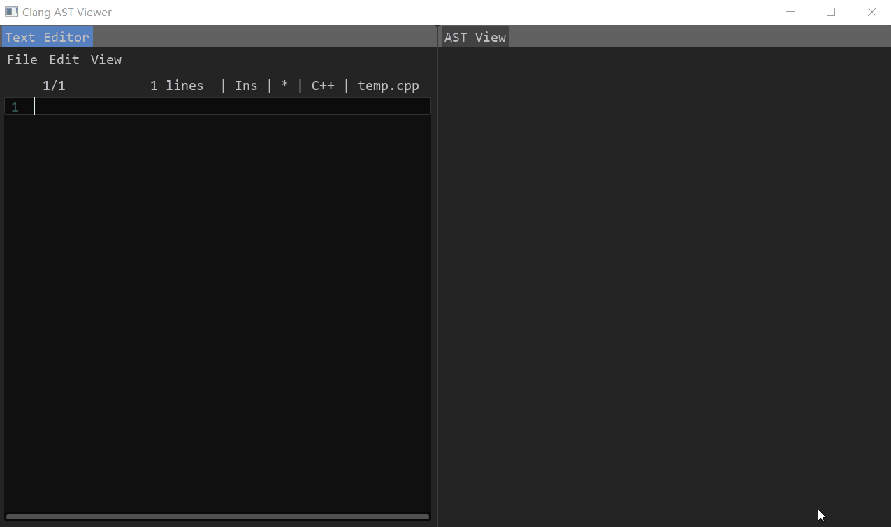

## Clang AST Viewer

## Introduce

- Analyze C++ code using libclang to display AST structure
- After downloading the source code, it is easy to build using cmake. So far, it has only been successfully tested on Windows 10, and a Release version has been released
- There is some interaction
- Any questions can be raised in Issues

### ScreenShot

## External dependencies

- imgui
- glad
- glfw
- libclang
- ...